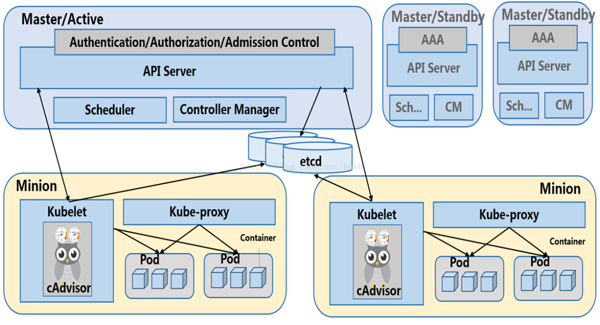

# Kubernetes集群搭建

## 一、集群介绍

### 1.1 集群组成

[官方介绍](https://kubernetes.io/zh-cn/docs/concepts/architecture)

集群由`API Server`、`etcd`、`Controller Manager`、`Scheduler`、`kubelet`、`kube-proxy`、`container runtime`等组件组成.



API Server: 提供资源对象的唯一操作入口，其他所有组件都必须通过它提供的API来操作资源数据，只有`API Server`与存储通信，其他模块通过API Server访问集群状态.

etcd: 存储集群状态的键值对，包括节点信息、服务信息、容器组信息等.

Controller Manager: 运行控制器，负责管理集群状态，比如创建、删除、更新集群对象，比如创建、删除、更新Pod、Service、ReplicationController、Deployment、DaemonSet、Job、CronJob等资源对象.

Scheduler: 调度器，负责将Pod调度到节点上，并确保每个Pod都在一个节点上运行，调度器会考虑节点的资源 occupation、节点的亲和性、节点的污点、节点的调度策略.

kubelet: 运行在每个节点上，负责管理Pod，Pod的容器运行时，Pod的资源监控，Pod的日志收集，Pod的健康检查，Pod的更新策略等.

kube-proxy: 是集群中每个节点（node）上所运行的网络代理， 实现 Kubernetes 服务（Service） 概念的一部分。kube-proxy 维护节点上的一些网络规则， 这些网络规则会允许从集群内部或外部的网络会话与 Pod 进行网络通信

container runtime: 运行容器，可以是Docker、containerd、CRI-O等.

网络插件：是实现容器网络接口（CNI）规范的软件组件。它们负责为 Pod 分配 IP 地址，并使这些 Pod 能在集群内部相互通信

### 1.2 集群角色

集群角色分为`Master`(也叫`control-plane`)和`Node`(也叫`work`)两种，`Master`节点上运行`API Server`、`etcd`、`Controller Manager`、`Scheduler`等组件，`Node`节点上运行`kubelet`、`kube-proxy`、`container runtime`等组件.

### 1.3 kubeadm介绍

[官方地址](https://kubernetes.io/zh-cn/docs/reference/setup-tools/kubeadm/)

`kubeadm`是一个用于创建和配置Kubernetes集群的工具，`kubeadm`可以自动完成集群的初始化、配置、升级等操作，并且支持使用`kubeadm`创建的集群进行扩容、缩容等操作.

## 二、集群搭建

### 2.1 框架介绍

这里使用`kubeadm`引导集群搭建。

宿主机部署组件：

- kubeadm：集群初始化、配置、升级等操作
- kubelet：集群节点运行时组件
- kubectl：集群操作工具
- containerd：容器运行时
- runc：containerd依赖
- crictl：CRI工具，可以用来管理镜像
- cni：基础网络插件接口

集群部署组件：

- calico：具体网络插件，需要手动部署
- kube-proxy：集群代理，由kubeadm引导
- etcd：集群状态存储，由kubeadm引导
- kube-apiserver：集群API入口，由kubeadm引导
- kube-controller-manager：集群控制器，由kubeadm引导
- kube-scheduler：集群调度器，由kubeadm引导
- coredns：集群DNS服务，由kubeadm引导

#### 2.2 配置机器

配置机器hostname

> hostnamectl set-hostname node001 && bash

``` shell
# 关闭swap
swapoff --all
sed -i -r '/swap/ s/^/#/' /etc/fstab
# 设置内核参数
modprobe br_netfilter
lsmod | grep br_netfilter
echo "br_netfilter" | sudo tee /etc/modules-load.d/br_netfilter.conf
cat /etc/modules-load.d/br_netfilter.conf
sysctl -w net.bridge.bridge-nf-call-iptables=1
echo "net.bridge.bridge-nf-call-iptables=1" | sudo tee /etc/sysctl.d/k8s.conf
sysctl --system
# 安装conntrack
yum install -y conntrack-tools
```

配置ipv4

``` shell
vi /etc/sysctl.conf
net.ipv4.ip_forward = 1
```

``` shel
mkdr -p ~/install/kubeadm
# 上传软件包到kubeadm目录
# ssh或其他传输方式
```

reboot: 重启机器

### 2.3 部署containerd

配置containerd、runc 、crictl

``` shell
mkidr -p ~/install/containerd; cd ~/install/containerd
tar -xvf ../kubeadm/containerd-1.7.27-linux-amd64.tar.gz
cd bin
install -m 755 ../../kubeadm/runc.amd64 ~/install/containerd/bin/runc
tar -xvf  ../kubeadm/crictl-v1.29.0-linux-amd64.tar.gz
cat > ~/install/containerd/bin/softlink.sh << EOF
ln -sf ~/install/containerd/bin/containerd  /usr/local/bin/containerd
ln -sf ~/install/containerd/bin/containerd-shim-runc-v2  /usr/local/bin/containerd-shim-runc-v2
ln -sf ~/install/containerd/bin/containerd-stress  /usr/local/bin/containerd-stress
ln -sf ~/install/containerd/bin/ctr  /usr/local/bin/ctr
ln -sf ~/install/containerd/bin/runc  /usr/local/bin/runc
ln -sf ~/install/containerd/bin/crictl  /usr/local/bin/crictl
EOF
sh softlink.sh
mkdir -p /opt/cni/bin
tar -xvf ../kubeadm/cni-plugins-linux-amd64-v1.3.0.tgz -C /opt/cni/bin/
```

添加环境变量，需要手动执行

``` shell
cat >> /etc/profile << EOF
export PATH=$PATH:/usr/local/bin
EOF
source /etc/profile
```

配置`systemctl`启动containerd

``` shell
cat > /usr/lib/systemd/system/containerd.service << EOF
[Unit]
Description=containerd container runtime
Documentation=https://containerd.io
After=network.target dbus.service

[Service]
ExecStartPre=-/sbin/modprobe overlay
ExecStart=/usr/local/bin/containerd

Type=notify
Delegate=yes
KillMode=process
Restart=always
RestartSec=5

# Having non-zero Limit*s causes performance problems due to accounting overhead
# in the kernel. We recommend using cgroups to do container-local accounting.
LimitNPROC=infinity
LimitCORE=infinity

# Comment TasksMax if your systemd version does not supports it.
# Only systemd 226 and above support this version.
TasksMax=infinity
OOMScoreAdjust=-999

[Install]
WantedBy=multi-user.target
EOF
```

生成默认`containerd`配置文件

``` shell
mkdir -p /etc/containerd
containerd config default > /etc/containerd/config.toml
```

修改sandbox配置

``` shell
sed -i 's/registry.k8s.io/私有镜像库地址/g' /etc/containerd/config.toml
# 确保变更成功
cat /etc/containerd/config.toml | grep "sandbox_image"
```

添加私有镜像库http拉取规则

vi etc/containerd/config.toml

``` shell
# [plugins."io.containerd.grpc.v1.cri".registry.mirrors]行下面添加
[plugins."io.containerd.grpc.v1.cri".registry.mirrors."私有镜像库地址"]
      # 指定镜像仓库的访问端点（endpoint），使用 HTTP 协议
      endpoint = ["http://私有镜像库地址"]
```

配置crictl

``` shell
cat > /etc/crictl.yaml << EOF
runtime-endpoint: unix:///run/containerd/containerd.sock
image-endpoint: unix:///run/containerd/containerd.sock
timeout: 10
debug: false
EOF
```

> systemctl enable --now containerd

### 2.4 部署kubeadm/kubelet/kubectl

``` shell
cat > ~/install/kubeadm/softlink.sh << EOF
ln -sf ~/install/kubeadm/kubeadm     /usr/local/bin/kubeadm
ln -sf ~/install/kubeadm/kubelet      /usr/local/bin/kubelet
ln -sf ~/install/kubeadm/kubectl      /usr/local/bin/kubectl
EOF
sh ~/install/kubeadm/softlink.sh
chmod +x ~/install/kubeadm/kube*
```

添加`kubelet`启动项

``` shell
cat > /usr/lib/systemd/system/kubelet.service << EOF
[Unit]
Description=kubelet: The Kubernetes Node Agent
Documentation=https://kubernetes.io/docs/
Wants=network-online.target
After=network-online.target

[Service]
ExecStart=/usr/local/bin/kubelet
Restart=always
StartLimitInterval=0
RestartSec=10

[Install]
WantedBy=multi-user.target
EOF

# kubelet启动配置
mkdir -p /usr/lib/systemd/system/kubelet.service.d
vi   /usr/lib/systemd/system/kubelet.service.d/10-kubeadm.conf
# Note: This dropin only works with kubeadm and kubelet v1.11+
[Service]
Environment="KUBELET_KUBECONFIG_ARGS=--bootstrap-kubeconfig=/etc/kubernetes/bootstrap-kubelet.conf --kubeconfig=/etc/kubernetes/kubelet.conf"
Environment="KUBELET_CONFIG_ARGS=--config=/var/lib/kubelet/config.yaml"
# This is a file that "kubeadm init" and "kubeadm join" generates at runtime, populating the KUBELET_KUBEADM_ARGS variable dynamically
EnvironmentFile=-/var/lib/kubelet/kubeadm-flags.env
# This is a file that the user can use for overrides of the kubelet args as a last resort. Preferably, the user should use
# the .NodeRegistration.KubeletExtraArgs object in the configuration files instead. KUBELET_EXTRA_ARGS should be sourced from this file.
EnvironmentFile=-/etc/sysconfig/kubelet
ExecStart=
ExecStart=/usr/local/bin/kubelet $KUBELET_KUBECONFIG_ARGS $KUBELET_CONFIG_ARGS $KUBELET_KUBEADM_ARGS $KUBELET_EXTRA_ARGS
```

配置开机自启
> systemctl enable --now kubelet

## 三、集群管理

### 3.1 启动master

创建集群，执行
> kubeadm init --image-repository 私有镜像库地址   --control-plane-endpoint  自己的vip

添加`kubeconfig`配置（为了执行kubectl）

``` shell
mkdir -p $HOME/.kube
cp -i /etc/kubernetes/tmp/kubeadm-init-dryrun2188684591/admin.conf $HOME/.kube/config
chown $(id -u):$(id -g) $HOME/.kube/config
```

### 3.2 添加控制节点

集群控制节点执行命令

``` shell
# 上传证书到集群, 生成的示例数据如 e58954268698d33c1ab8fa8b818df9f8f0fa991f3e2ba03dbd3f769fc595c061, 添加到kubeadm join命令中  --certificate-key 
kubeadm init phase upload-certs --upload-certs 
# 生成加入节点命令，包含token
kubeadm token create --print-join-command
```

待加入节点执行命令（不能直接拷贝下面的命令）

> kubeadm join vip:6443 --token wlv0ko.3l2ympzam0nckggf --discovery-token-ca-cert-hash sha256:ec820817b1df0931ada889aed988a7cca763a30d258a7efeb0e7c493c8534be4  --certificate-key e58954268698d33c1ab8fa8b818df9f8f0fa991f3e2ba03dbd3f769fc595c061   --control-plane

上面命令我将他分为三部分

1. `kubeadm join vip:6443 --token wlv0ko.3l2ympzam0nckggf --discovery-token-ca-cert-hash sha256:ec820817b1df0931ada889aed988a7cca763a30d258a7efeb0e7c493c8534be4`是`kubeadm token create --print-join-command`生成
2. `--certificate-key e58954268698d33c1ab8fa8b818df9f8f0fa991f3e2ba03dbd3f769fc595c061`是`kubeadm init phase upload-certs --upload-certs`生成
3. `--control-plane`是添加控制节点标识

### 3.3 添加工作节点

与添加控制节点类似

集群控制节点执行命令

``` shell
# 生成加入节点命令，包含token
kubeadm token create --print-join-command
```

待加入节点执行命令（不能直接拷贝下面的命令）

> kubeadm join vip:6443 --token wlv0ko.3l2ympzam0nckggf --discovery-token-ca-cert-hash sha256:ec820817b1df0931ada889aed988a7cca763a30d258a7efeb0e7c493c8534be4

这个命令是可以在`kubeadm token create --print-join-command`输出中获取。

